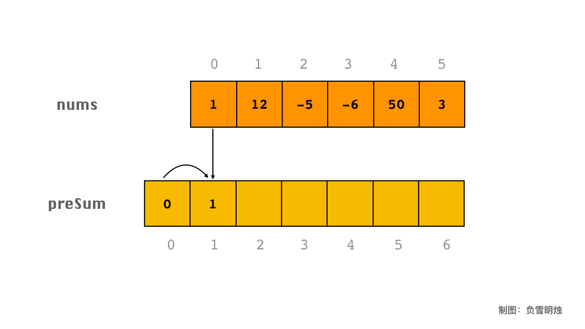

# 前缀和模板二

模板一在求解「前缀和」以及在利用「前缀和」求「区间和」的时候，我们都对数组的第 $0$ 个位置做了特殊的判断。为了省掉这个特殊判断，我们常常把「前缀和」数组 `preSum` 的长度定义为原数组的长度 + 1。

`preSum` 的第 0 个位置，相当于一个占位符，置为 0。

那么，就可以把 `preSum` 的公式统一为 **`preSum[i] = preSum[i - 1] + nums[i - 1]`，**此时的 **`preSum[i]`** 表示 **`nums`**中 $i$ 元素左边所有元素之和（不包含当前元素 $i$）。

下面以 `[1, 12, -5, -6, 50, 3]` 为例，用动图讲解一下如何求 `preSum`。



求 `preSum` 数组的过程是——

```c++
preSum[0] = 0;
preSum[1] = preSum[0] + nums[0];
preSum[2] = preSum[1] + nums[1];
...
```


对应的代码如下：


<!-- tabs:start -->

#### **Java**

```java
class Solution {
    public int[] runningSum(int[] nums) {
        int N = nums.length;
        int[] preSum = new int[N + 1];
        for (int i = 0; i < N; ++i) {
            preSum[i + 1] = preSum[i] + nums[i];
        }
        return preSum;
    }
}
```

#### **C++**


```c++
vector<int> runningSum(vector<int>& nums) {
    const int N = nums.size();
    vector<int> preSum(N + 1, 0);
    for (int i = 0; i < N; ++i) {
        preSum[i + 1] = preSum[i] + nums[i]; 
    }
    return preSum;
}
```

#### **Python**

```python
class Solution(object):
    def runningSum(self, nums):
        N = len(nums)
        preSum = [0] * (N + 1)
        for i in range(0, N):
            preSum[i + 1] = preSum[i] + nums[i]
        return preSum
```

<!-- tabs:end -->

注意，上面的代码中没有给 `preSum[0]` 赋值，在 C++ 中 `vector<int>` 的默认值为 0。

- 时间复杂度：$O(N)$;

- 空间复杂度：$O(N)$。


「前缀和」的思想比较简单，分为两个步骤，需要注意细节：

1. 预处理得到前缀和 preSum 数组（这一步很少出问题）；
2. 通过 preSum 数组计算数组中某个区间的和（这一步可能出问题，需要注意定义的 $preSum[i]$ 是否包含了$nums[i]$）。

刷题时，难点在于怎么想到使用「前缀和」—— 如果题目考察了「区间和」，那么可以考虑「前缀和」；另外也可以考虑用滑动窗口。
